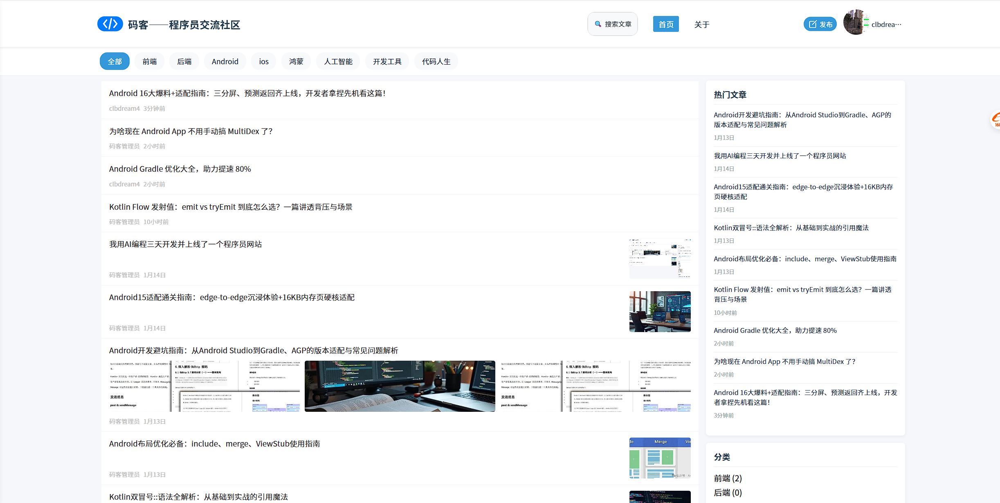
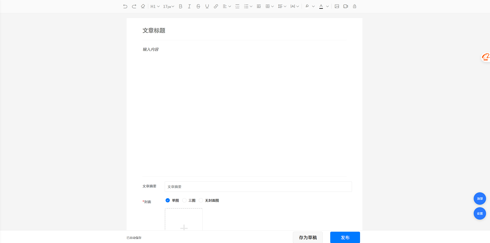
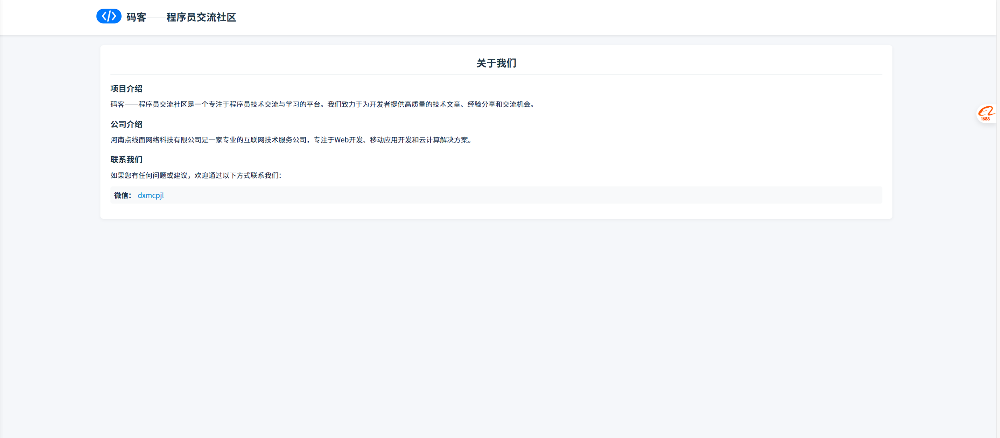

# 码客——程序员交流社区 (make_user)

## 项目简介

"码客——程序员交流社区"是一个专注于程序员技术交流与学习的平台。该项目作为用户端，提供文章浏览、搜索、分类查看等功能，为开发者提供高质量的技术文章、经验分享和交流机会。

## 重要说明  
本项目为前端模块，如需正常使用还需要管理端，可联系作者获取，需要付费使用，介意者勿扰，微信：dxmcpjl

**在线演示**：[码客——程序员交流社区](https://make.dxmwl.com)

## 项目特点

- **响应式设计**：适配移动端和桌面端，提供良好的用户体验
- **文章管理**：支持文章分类、标签云、热门文章等功能
- **简洁界面**：清爽的UI设计，专注阅读体验
- **关于我们页面**：提供项目和公司介绍，以及联系方式

## 项目截图

以下为项目的主要页面截图：








## 功能特性

- 文章列表展示（支持单图、三图等多种布局）
- 文章分类浏览
- 标签云功能（随机显示20个标签）
- 热门文章推荐
- 搜索功能
- 关于我们页面（包含项目介绍、公司信息和联系方式）

## 技术栈

- **前端框架**：uni-app
- **UI组件库**：uni-ui
- **云开发**：uniCloud
- **数据库**：uniCloud Database
- **响应式布局**：CSS媒体查询

## 页面结构

- 首页：文章列表、分类导航、热门文章、标签云
- 文章详情页：支持响应式布局（移动端100%，桌面端60%）
- 搜索页：文章搜索功能
- 关于我们：项目和公司介绍页面

## 响应式设计

- 移动端：文章内容区域占满容器宽度
- 桌面端：文章内容区域限制为60%宽度，提升阅读体验

## 联系方式

- 微信：dxmcpjl

## 项目信息

- 版本：1.0.0
- 公司：河南点线面网络科技有限公司
- 备案号：豫ICP备2023000435号-1

## 目录结构

```
make_user/
├── pages/                  # 页面文件
│   ├── index/index.vue    # 首页
│   ├── about/about.vue    # 关于我们页面
├── uni_modules/            # uni-app插件模块
├── static/                 # 静态资源
├── manifest.json           # 项目配置文件
├── pages.json              # 页面路由配置
└── README.md              # 项目说明文档
```

## 安装与运行

1. 确保已安装 HBuilderX 或其他支持 uni-app 的开发环境
2. 克隆项目到本地
3. 打开项目根目录
4. 运行项目（支持 H5、小程序、App 等多种平台）

## 依赖模块

- uni-cms-article：文章管理组件
- uni-ui：UI组件库
- uniCloud：云端服务

## 版本更新日志

### v1.0.0
- 初始化项目
- 实现文章列表展示功能
- 添加文章分类浏览
- 集成标签云功能（随机显示20个标签）
- 添加热门文章推荐
- 实现搜索功能
- 创建关于我们页面
- 实现响应式设计（移动端100%，桌面端60%）
- 添加微信联系方式（dxmcpjl）
- 优化移动端和桌面端用户体验